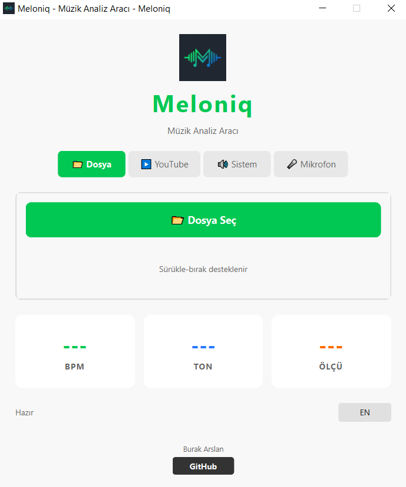

<div align="center">
  
</div>

# Meloniq - Music Analysis Tool

Meloniq is a powerful desktop application for analyzing music. It provides key detection, BPM estimation, and meter analysis from various audio sources.



[Türkçe Dökümantasyon (Turkish Documentation)](README_TR.md)

## Features

-   **Multi-Source Analysis**:
    -   📁 **File**: Analyze audio files (MP3, WAV, FLAC, etc.) via drag & drop.
    -   ▶️ **YouTube**: Download and analyze directly from YouTube links (Playlists and Radio mixes are filtered).
    -   🔊 **System Audio**: Capture and analyze internal computer audio in real-time.
    -   🎤 **Microphone**: Record and analyze external audio sources.
-   **Advanced Analysis**:
    -   Global BPM estimation.
    -   Key detection (Major/Minor).
    -   Meter (Time Signature) estimation.
-   **User Interface**:
    -   Modern, clean PyQt6 interface.
    -   Bilingual Support (English / Turkish).
    -   Real-time spectrogram visuals.

## Installation

### From Source

1.  **Clone the repository**:
    ```bash
    git clone https://github.com/burakarslan0110/meloniq.git
    cd meloniq
    ```

2.  **Run the wrapper script** (Windows):
    Double-click `start_meloniq.bat` or run:
    ```cmd
    start_meloniq.bat
    ```
    *This script handles virtual environment creation and dependency installation automatically.*

### Pre-built Executable

Install using the provided [`Meloniq_Setup`](https://github.com/burakarslan0110/meloniq/releases/latest) executable.

## Building from Source

To build a standalone executable:

```bash
# Activate venv
.\venv\Scripts\activate

# Run PyInstaller
pyinstaller meloniq.spec --clean --noconfirm
```

## Requirements

-   Python 3.8+
-   FFmpeg (included in builds, or system-wide for source)
-   Visual C++ Redistributable (for some dependencies)

## License

MIT License. See LICENSE file for details.
